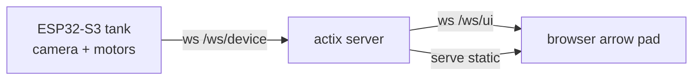

# S3 Tank Web Remote

Remote-control an ESP32-S3 tank from a browser: the tank registers as a device over
websocket, drives 2 DC motors from an on-screen arrow pad, and streams its camera.



## Layout

- `remote/` — actix-web websocket server + vite UI, served through nginx, wired with docker compose
- `esp_cam_tank/` — ESP32-S3 firmware (Rust, esp-idf-svc): OV3660 camera, LEDC motor PWM, ws client

## Run

### 1. Server

With docker (from `remote/`):

```sh
docker compose up --build
```

UI: http://localhost:8081 — ESP endpoint: `ws://<server-lan-ip>:8081/ws/device`

Or dev mode (backend :8080, vite proxying `/ws`):

```sh
cargo run                        # remote/
cd vite && yarn && yarn dev      # remote/vite/
```

Smoke test the relay with `node scripts/smoke.mjs` (backend must be running).

### 2. Tank firmware

Needs the xtensa Rust toolchain (`espup`). From `esp_cam_tank/`:

```sh
cp .env.sample .env             # fill in WIFI_SSID / WIFI_PASS / WS_URL
./build.sh                      # source .env + cargo build --release
cargo run --release             # build + flash + monitor
```

`WS_URL` examples:

| server | WS_URL |
|---|---|
| LAN direct | `ws://<server-lan-ip>:8080/ws/device` |
| LAN via nginx | `ws://<server-lan-ip>:8081/ws/device` |
| VPS + TLS | `wss://tank.example.com/ws/device` |

Config is baked in at build time — changing it means rebuild + reflash.

### 3. Drive

Open http://localhost:8081. Arrow buttons (touch/mouse) or keyboard arrows;
space = stop. Camera frames and telemetry stream from the tank.

## Ports

| port | what |
|---|---|
| 8080 | backend ws server (direct from ESP) |
| 8081 | nginx: UI + `/ws/` proxy |

Details: `remote/README.md`, `esp_cam_tank/README.md`.
